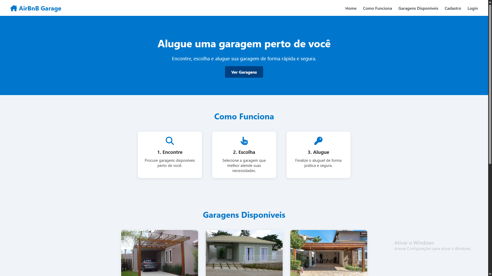
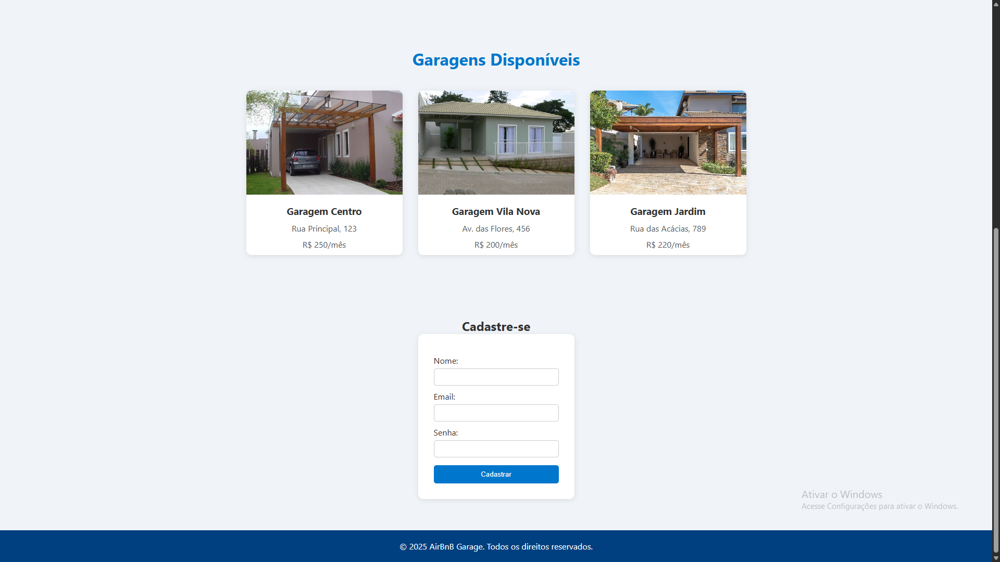

# AirBnB Garage

Projeto desenvolvido com HTML e CSS durante o curso técnico, com o objetivo de simular uma plataforma de aluguel de garagens.

## Tecnologias
- HTML
- CSS

## Funcionalidades
- Navegação por seções (single page)
- Layout estruturado
- Listagem de garagens
- Formulário de cadastro

## Objetivo
Praticar desenvolvimento web, estruturação de páginas e organização de layout.

## Como executar
1. Baixe os arquivos do projeto
2. Abra o arquivo `Site-Trabalho.html` no navegador

## Preview 

